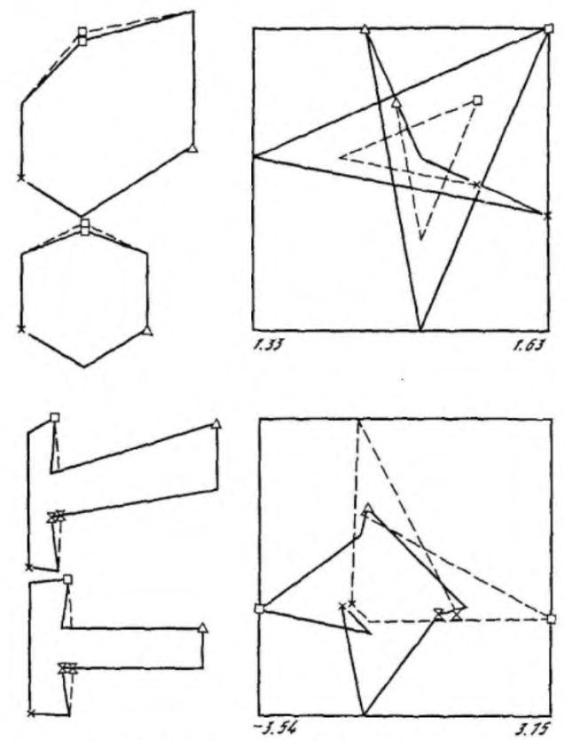

# Николаев: форма по движению через проективные инварианты

## Работа и её место

«Модели константного зрительного восприятия» П.П. Николаева вышли в 1987 году в
сборнике «Интеллектуальные процессы и их моделирование» (М.: Наука) — итоговая,
программная работа, подводящая черту под многолетним циклом его исследований в
Институте проблем передачи информации. Это большая статья двойного состава: первая
её часть посвящена цветовой константности, вторая — восстановлению формы
движущегося объекта. Настоящий комментарий разбирает только вторую часть; цветовая
теория и завершающая статью гипотеза о перцептивной модели зрительного
пространства («константном экране») — предмет отдельных текстов.

Уже само соседство двух частей под одной обложкой выражает сквозную мысль
Николаева: окраска и форма суть две грани единой задачи — отыскания инвариантных
признаков предмета, по которым его можно узнать сквозь изменчивость условий
наблюдения. Если в цветовой части инвариант ищется относительно смены освещения,
то в динамической — относительно смены ракурса при движении. Восприятие формы
здесь с самого начала поставлено как задача узнавания, и потому работа естественно
ложится в раздел об опознании.

## Задача: структура по движению как самостоятельная проблема

Николаев формулирует задачу так: для объекта неизвестной формы, совершающего
некоторый тип движения с неизвестными параметрами, вычислить — с точностью до
масштабного коэффициента — трёхмерные координаты всех его точек и определить
характеристики движения, располагая лишь координатами точек на центральной
проекции за ряд последовательных моментов. Кратко он обозначает её формулой
«трёхмерная структура по двумерному движению».

Принципиально, что эта задача мыслится как *независимая* от статического
восприятия формы, а не как его уточнение. Довод предъявлен прямой: при
демонстрации кинетического эффекта глубины (объёмная форма, видимая во вращающемся
облаке точек или в теневой проекции) любой отдельно взятый кадр может вообще не
нести интерпретируемой информации о форме — она возникает только из совместного,
кооперативного поведения точек во времени. Значит, динамика — самостоятельный
источник трёхмерности, а не довесок к статике. Отсюда и иное описание объекта: в
статике носителем сведений служит непрерывная окрашенная поверхность, в динамике —
дискретный набор особых, контрастных точек, прослеживаемых от момента к моменту.

Этот ход вписан в более широкую гипотезу Николаева о том, что механизмы
инвариантного восприятия объекта и механизмы константности всего зрительного поля
родственны по форме представления информации, а движение регистрируется зрением
дискретно, по тактам, силами иконической памяти. Дискретность здесь не упрощающее
допущение, а содержательная позиция: она отсылает к скачкообразным движениям глаза
с фазами саккадического подавления и переводит восприятие движения в задачу
*ассоциации* последовательных мгновенных картин.

## Установление соответствия

Прежде чем извлекать форму, система должна решить, какие точки разных кадров суть
проекции одной и той же точки объекта, — задачу установления соответствия. Николаев
опирается здесь на два тезиса, которые принимает как надёжно доказанные: соответствие
устанавливается операцией нижнего уровня, не зависящей от трёхмерной интерпретации
сцены и работающей только с опорными контрастными точками; и между действительным
(плавным) и кажущимся (составленным из дискретных предъявлений) движением в этой
операции нет принципиальной разницы. Первый тезис разрывает порочный круг
«соответствие ↔ интерпретация» в пользу первичности соответствия; второй
оправдывает потактную, ассоциативную трактовку.

Здесь стоит отметить — это черта самого текста, а не привнесённое сравнение, — что
Николаев берёт оба тезиса у Ульмана и в той же мере сознательно от Ульмана
отстраивается. Где Ульман работает с ортогональной проекцией и методом
«минимального отображения», Николаев настаивает на центральной (перспективной)
проекции и предлагает другой механизм соответствия — ассоциацию проективных
инвариантов, замечая, что минимальное отображение даёт ложную корреспонденцию при
больших смещениях объекта за такт. Развёрнутое сопоставление двух подходов — тема
отдельного разбора; здесь важно, что полемика встроена в саму постановку Николаева.

## Язык вурфов

Сердцевина второй части — аппарат, который Николаев называет языком вурфов.
**Вурфом** он именует двойное отношение четырёх точек на прямой — фундаментальный
инвариант проективных преобразований, то есть величину, не меняющуюся при любых
проективных искажениях, какие центральная проекция вносит в образ объекта при смене
ракурса. Различаются два рода вурфов: **пространственный** (s-вурф) — по разным
точкам одного кадра, и **временной** (t-вурф) — по положениям одной и той же точки
в разные такты.

На плоскости вурф строится по пяти точкам общего положения, и тогда любой замкнутый
контур более чем с четырьмя точками (например, вершинами многоугольника) можно
описать циклической последовательностью таких чисел — инвариантно относительно всей
группы проективных преобразований плоскости. Это и есть ключевая идея: форма
кодируется не координатами, которые «плывут» при смене ракурса, а набором чисел,
которые при проективных искажениях сохраняются.

Рис. 3. Проективно-инвариантное представление фигур

Отсюда — новый механизм установления соответствия: вместо геометрического
сопоставления точек система сопоставляет упорядоченные наборы вурфов, безразличные
к сдвигам, поворотам и перспективным искажениям проекции, и устанавливает
поименованное соответствие сразу для всех точек набора. Самое изящное в этом
аппарате — то, что Николаев называет «разменом времени на пространство»: жёсткость и
инерциальность движения позволяют строить смешанные s/t-инварианты, снижая и
требуемую глубину памяти (для временных вурфов), и громоздкость пространственного
базиса (для пространственных). Так, у объекта, движущегося прямолинейно и
равномерно, временной вурф любой точки за любые четыре такта равен 4/3, а у
равномерно вращающегося — выражает угловую скорость.

## Центральная проекция: выбор и его цена

Выбор центральной проекции вместо ортогональной — методологическое решение,
которое Николаев отстаивает специально. Центральная проекция точнее отражает
геометрию реального глаза; то, что в ортогональном подходе выглядит как
пренебрежимое перспективное искажение, здесь прямо работает на решение задачи.
Более того, в схеме параллельной проекции некоторые задачи в принципе неразрешимы —
например, оценка глубины для объекта, который движется вдоль оптической оси или
вращается вокруг оси, ей параллельной. Перспектива, кажущаяся помехой, оказывается
ресурсом.

У этого выбора есть и оборотная сторона, которую Николаев не скрывает, и честный
портрет работы обязан её назвать. Метод численно хрупок: в экспериментах с
программой ВУРФ для среднего отклонения всего в 1° при оценке углов трёхгранника
потребовалась точность задания координат не хуже 0.0005 — то есть для объекта с
угловой апертурой около 100° координаты точек нужно знать с погрешностью менее трёх
угловых минут. Двойные отношения чувствительны к точности входных данных, и эта
чувствительность — встроенная плата за общность проективного аппарата.

## Программы ВУРФ и ГЕКС

Аппарат проверялся двумя имитационными программами, которые сам Николаев аттестует
скромно — как «отладочные для идей», и это важная оговорка о статусе результатов.
Перед нами не доказанные теоремы, а вычислительные эскизы, нащупывающие границы
возможного.

**ВУРФ** служила выяснению принципиальных возможностей языка инвариантов: при
намеренно упрощённых условиях (заданные извне типы движения и соответствие точек,
исключённая окклюзия) она вычисляла по пространственным и временным вурфам
межтактовый угол поворота и пространственные параметры точек вращающегося или
прямолинейно движущегося объекта. **ГЕКС** делала следующий шаг — к более сложному
движению непрозрачного многогранника (совмещение вращения и трансляции,
равноускоренное вращение) со встроенными этапами установления соответствия,
переориентирования системы в канонический координатный базис и экстраполяции карты
точек на следующий такт с предсказанием ухода точек за пределы видимости и их
появления. Многогранники выбраны не случайно: статическая цветовая обработка
проекции полиэдра «бесплатно» даёт карту его рёбер, концевые точки которых и служат
входом динамической задачи, — здесь видна та самая спайка цвета и формы, что держит
работу в целом.

## Вклад и место в истории

Главный вклад этой части — сам **язык проективных инвариантов** как средство
описания формы по движению. Идея кодировать форму вурфами, инвариантными к
ракурсу, и сводить установление соответствия к ассоциации инвариантных наборов —
оригинальный и самобытный ход, выросший из отечественной традиции теории зрения
(ИППИ, работы Нюберга, Бонгарда, Максимова, Петрова) и из переосмысления
синтетической геометрии в духе гештальт-психологии. Опора именно на центральную
проекцию выделяет подход Николаева на фоне преобладавших в ту пору ортогональных
схем.

Трезвая оценка требует назвать и пределы. Это эскиз исследовательской программы, а
не завершённая теория: ясные перспективы вурфов в задаче установления соответствия
сам Николаев не сопровождает столь же уверенными прогнозами для вычисления формы по
неинерциальным движениям; численная хрупкость метода реальна; а воплощение
проективных инвариантов виделось ему скорее в будущих аналоговых «построительно-
измерительных» структурах, чем в прямом счёте. Работа осталась преимущественно
внутри отечественного контекста и широкого международного резонанса, сопоставимого
с её замыслом, не получила.

## Зачем это в разделе «Опознание»

Для темы опознания эта часть ценна особым поворотом самой идеи инварианта. Узнать
движущийся объект как тот же самый, сохраняющий форму при непрерывной смене
ракурса, — значит опереться на то, что в потоке проективных искажений остаётся
неизменным. Николаев предлагает на роль такого неизменного не метрические величины
(расстояния, углы), а проективные инварианты — вурфы, переживающие перспективу.
Опознание формы оказывается здесь считыванием инвариантов проективной группы, и эта
постановка задаёт раздела самостоятельную, геометрически глубокую перспективу
взгляда на узнавание.
