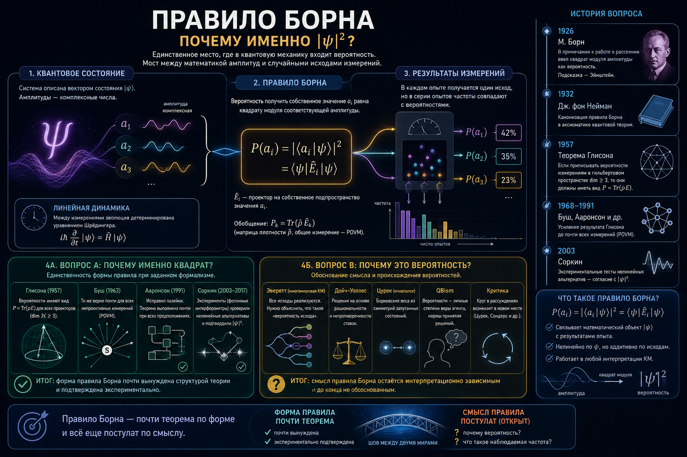

# Правило Борна

Правило Борна — это закон, по которому квантовая механика сопоставляет вектору состояния вероятности исходов измерения: вероятность получить значение $\lambda$ равна квадрату модуля соответствующей амплитуды. На вид — техническая формула из учебника. На деле это единственное место, где в теорию вообще входит вероятность: вся остальная динамика, уравнение Шрёдингера, строго детерминирована. Правило Борна — это шов, которым сшиты две несоизмеримые ткани: гладкий детерминированный формализм с одной стороны и наблюдаемые в опыте случайные частоты с другой.

Отсюда и проблема, вынесенная в заголовок: **постулат это или теорема?** Иначе говоря — приходится ли вводить правило Борна руками, как независимую аксиому, или его можно вывести из остального аппарата? Сразу обозначу тезис, к которому мы придём, потому что он расщепляет вопрос надвое и снимает большую часть путаницы. *Форма* правила — то, что вероятность есть именно квадрат модуля амплитуды, а не какая-то иная функция, — формализмом почти вынуждена (теорема Глисона) и вдобавок выдерживает прямую экспериментальную проверку против нелинейных альтернатив. А вот *статус* этой величины как вероятности — то, почему вообще возникают вероятности и почему эти числа совпадают с наблюдаемыми частотами, — остаётся интерпретационно зависимым и до конца не обоснованным. Правило Борна — буквально то место, где живут вероятности, о которых шла речь в статьях про [проблему измерения](../measurement/) и [квантовый индетерминизм](../indeterminism/); это третья грань одного узла.

## Формулировка

### Сам закон

Пусть система описана нормированным вектором $|\psi\rangle$, а измеряется наблюдаемая $\hat A$ с собственными состояниями $|a_i\rangle$. Правило Борна говорит: исходом будет одно из собственных значений, причём значение $a_i$ выпадает с вероятностью

$$P(a_i) = |\langle a_i|\psi\rangle|^2 = \langle\psi|\hat E_i|\psi\rangle,$$

где $\hat E_i$ — проектор на соответствующее собственное подпространство. В более общем виде, через матрицу плотности $\hat\rho$, вероятность записывается как $P(a_i)=\operatorname{Tr}(\hat\rho\,\hat E_i)$, а для самых общих измерений (POVM) — как $\operatorname{Tr}(\hat\rho\,\hat E_k)$ по набору положительных операторов, дающих в сумме единицу. Эти обобщения важны технически, но концептуально суть одна: вероятность есть квадратичная форма от амплитуды.

### Почему именно квадрат — и почему это проблема

Квадрат модуля $|\langle a_i|\psi\rangle|^2$ — это амплитуда, умноженная на комплексно сопряжённую. Он автоматически вещественен и неотрицателен, то есть годится в вероятности. Но почему вторая степень, а не первая или четвёртая? И, шире, почему вообще *вероятность*, если динамика детерминирована?

Здесь и коренится проблема. Правило Борна выглядит постулатом, пристёгнутым к остальной теории извне. Оно нелинейно (квадрат), тогда как эволюция линейна; оно вероятностно, тогда как эволюция причинна; оно связывает математический объект $|\psi\rangle$ с тем, что реально показывает счётчик. Все странности, разбираемые в двух соседних статьях, стекаются именно сюда: правило Борна — это формула того самого случайного, единственного исхода.

### Два разных вопроса

Чтобы не ходить по кругу, разведём, как и в предыдущих текстах, две совершенно разные задачи.

**(A) Единственность.** Если уж приписывать измерениям вероятности в рамках гильбертова формализма, обязаны ли они быть именно $|\psi|^2$? Это математический вопрос о том, насколько форма правила вынуждена структурой теории.

**(B) Обоснование.** Почему вообще возникают вероятности — и почему предписанные правилом числа совпадают с частотами, наблюдаемыми в длинных сериях опытов? Это концептуальный вопрос о *происхождении* и *смысле* борновской вероятности. Он особенно остёр там, где фундаментальной случайности нет вовсе: в многомировой интерпретации все исходы реализуются, и тогда непонятно, что вообще значит «вероятность исхода».

Дальше я покажу, что (A) по существу решено, а (B) — нет; и что почти все споры вокруг правила Борна происходят от смешения этих двух вопросов.

## История вопроса

### Примечание Борна 1926 года

Правило родилось в июле 1926 года в работе Борна о рассеянии. Любопытна сама фактура открытия: в основном тексте Борн писал, что амплитуда «определяет вероятность» исхода, и лишь в примечании, добавленном при корректуре, уточнил, что вероятность пропорциональна *квадрату* модуля. То есть знаменитая вторая степень появилась буквально в сноске. Борн прямо признавал, что подсказку дал Эйнштейн: тот предлагал толковать квадрат амплитуды оптической волны как плотность вероятности обнаружить фотон, и Борн перенёс эту мысль на $\psi$-функцию. За статистическую интерпретацию Борн получил Нобелевскую премию в 1954 году — почти через три десятилетия.

Стоит отметить и отвергнутую альтернативу. Сам Шрёдингер поначалу надеялся читать $|\psi|^2$ как реальную плотность заряда или массы размазанного электрона. Эта трактовка не выдержала: волновой пакет расплывается, а электрон всегда регистрируется как целое в одной точке. Победило вероятностное прочтение Борна, и оно стало ядром копенгагенской интерпретации — с естественным ансамблевым, частотным истолкованием вероятности по множеству одинаково приготовленных систем.

### Канонизация и первые попытки вывода

Джон фон Нейман в 1932 году встроил правило в строгий аппарат: проективные измерения, спектральная теорема, статистический оператор. У него правило Борна — часть постулата измерения, то есть честно вводится как аксиома. Вопрос, нельзя ли его *вывести*, поставил позднее Джордж Маки, и ответом стала теорема Глисона (1957).

С 1960–70-х годов пошли и другие программы вывода. Частотный подход (Финкельштейн, Хартл 1968) пытался получить правило из рассмотрения бесконечных ансамблей — показать, что в пределе многих копий «частотный оператор» даёт борновские веса. Эти попытки преследовало обвинение в порочном круге: чтобы говорить о пределе частот, уже нужна мера на исходах, эквивалентная искомой. Позже центр тяжести сместился к выводам внутри многомировой интерпретации (Дойч, 1999; Уоллес) и к аксиоматическим реконструкциям всей теории (Харди 2001; Мазанес–Галлей–Мюллер 2019; Сондерс 2021), к которым мы сейчас перейдём.

## Постулат или теорема? Программы вывода

Расположим попытки по тому, что именно они доказывают и какой ценой, — это, как и в соседних статьях, превращает разнородный список в карту.

### Что доказывает Глисон — и чего не доказывает

Теорема Глисона — главный аргумент в пользу того, что форма правила *вынуждена*. Она утверждает: в гильбертовом пространстве размерности $\ge 3$ всякая непротиворечивая, неконтекстуальная вероятностная мера на проекторах (такая, что вероятности взаимно ортогональных исходов складываются) обязана иметь вид $\operatorname{Tr}(\hat\rho\,\hat E)$ — то есть в точности борновский. Никакого произвола в выборе функции от амплитуды не остаётся: вторая степень не подгоняется, а выводится. Позднее Буш (2003) и независимо Кейвс с соавторами распространили результат на обобщённые измерения (POVM), сняв ограничение на размерность, — так что теперь это работает и для кубита.

> Теорема Глисона показывает, что *форма* правила Борна вынуждена структурой измерений, — но она не объясняет, почему вообще возникают вероятности и почему они равны наблюдаемым частотам.

Это и есть граница её силы. Во-первых, Глисон предполагает неконтекстуальность — что вероятность исхода не зависит от того, в какой полный набор совместимых измерений он встроен; Белл справедливо замечал, что это допущение нетривиально и само нуждается в обосновании. Во-вторых, и это важнее, теорема исходит из того, что мы *уже* приписываем измерениям вероятности, и лишь фиксирует их форму. Она отвечает на вопрос (A) и молчит о (B): откуда берётся сама вероятностная структура и почему предсказанные числа реализуются как частоты.

### Выводы внутри многомировой интерпретации

Именно в эвереттовской картине вопрос (B) становится мучительным, и потому ей стоит уделить отдельное место — здесь сделано больше всего попыток, и здесь же яснее всего виден упирающийся в них тупик. Коллапса нет, эволюция строго унитарна, при измерении все исходы реализуются в ветвящихся мирах. Но тогда само понятие вероятности повисает: какой смысл говорить, что исход $a_1$ «вероятнее» исхода $a_2$, если оба случаются заведомо и с одинаковой реальностью? Уоллес удачно разделил тут две задачи. *Проблема осмысленности* (incoherence problem): как вообще может быть вероятность в мире, где происходит всё? И *количественная проблема* (quantitative problem): почему веса именно $|\psi|^2$, а не, скажем, равные для всех ветвей? Вторую без первой решать бессмысленно, и именно на стыке двух задач ломаются почти все выводы.

**Исходная попытка самого Эверетта (1957).** Эверетт пытался вывести правило ещё в диссертации. Он ввёл на множестве ветвей *меру* и потребовал от неё двух вещей: аддитивности и зависимости только от модулей амплитуд. Этого почти достаточно: единственная такая мера — квадратичная, то есть $|\psi|^2$. Затем Эверетт показал, что в этой мере совокупность ветвей, вдоль которых записанные наблюдателем относительные частоты *отклоняются* от борновских, имеет меру, стремящуюся к нулю при росте числа измерений. Вывод: «почти все» наблюдатели (в смысле этой меры) видят борновскую статистику. Линию развили ДеВитт и Грэхем (1973), а в форме «частотного оператора» — Хартл (1968).

И здесь же сразу виден дефект, отравляющий всю программу. Аргумент «множество отклоняющихся ветвей имеет меру нуль» работает как довод о вероятности только если мы *уже* читаем эту меру как вероятность. Но множество меры нуль вполне может содержать реально осуществившиеся ветви — а в эвереттовской онтологии они и осуществляются, причём так же реально, как все прочие. Почему наблюдатель должен считать себя «типичным» относительно именно $|\psi|^2$-меры, а не относительно, например, равномерного счёта ветвей? Без ответа на это «мера нуль» не означает «не происходит» и даже «маловероятно». Это и есть зерно обвинения в порочном круге: квадратичная мера выводится, но её *отождествление с вероятностью* постулируется — а именно оно и требовалось.

**Теоретико-решающий подход (Дойч, 1999; развит Уоллесом).** Чтобы обойти этот круг, Дойч предложил вообще не говорить о вероятности напрямую, а вывести борновские веса как *рациональные ставки*. Идея: поместим эвереттовского агента перед игрой на исходы измерения и потребуем, чтобы его предпочтения подчинялись аксиомам теории принятия решений (транзитивность, безразличие к несущественным деталям и т. п.). Дойч заявил, а Уоллес впоследствии развил в подробное доказательство (с ключевыми посылками вроде «эквивалентности состояний с равными амплитудами» и невозмутимости предпочтений при тонком ветвлении), что такой агент *обязан* взвешивать ветви по $|\psi|^2$ — любые другие веса нарушают аксиомы рациональности. Это самая проработанная из эвереттовских программ.

**Инвариантность относительно сцепления (envariance, Цурек, 2003–2005).** Чисто симметрийный ход. Если система максимально сцеплена с окружением и все амплитуды равны по модулю, то существует преобразование среды, возвращающее полное состояние к исходному, но переставляющее исходы системы. Отсюда Цурек заключает, что равноамплитудные исходы обязаны иметь равные вероятности, а общий случай сводит к равноамплитудному дроблением, — и получает $|\psi|^2$, опираясь, как он подчёркивает, только на симметрии сцепления, без обращения к наблюдателю. Этим программа Цурека принципиально отличается от линии Дойча–Уоллеса: борновские веса извлекаются не из аксиом рациональности агента, а из объективной структуры запутанности, — что делает её особенно привлекательной для тех, кто (как и автор этих строк) считает наблюдателя производной, а не первичной фигурой в основаниях.

**Самолокализующая неопределённость (Сибенс–Кэрролл, 2018).** Здесь вероятность делается честно эпистемической: в краткий миг после ветвления, но *до* того, как наблюдатель узнал свой исход, он не знает, в какой ветви находится, — и эту неопределённость «в какой я копии» предлагается количественно оценивать по $|\psi|^2$.

**Счёт ветвей (Сондерс, 2021).** Ветви переопределяются так, чтобы все имели равную 2-норму; тогда простое отношение их *числа* воспроизводит борновские веса — попытка вернуть наивный «считаю исходы» к жизни, перенеся всю работу в определение того, что считать одной ветвью.

Все эти выводы объединяет один упрёк, и я считаю его по существу справедливым: **порочный круг** (а заодно — нерешённость проблемы осмысленности). Эверетт отождествляет меру с вероятностью; Дойч и Уоллес закладывают в аксиомы рациональности посылки (та же «эквивалентность равных амплитуд»), уже несущие в себе квадрат; Цурек предполагает, что симметричным исходам *вообще* приписываются вероятности, то есть что вероятность здесь уже есть; Сибенс и Кэрролл вводят меру самолокализации, эквивалентную искомой, и опираются на спорный «промежуток незнания»; Сондерс переносит весь произвол в определение ветви. Критики — Барнум, Кейвс, Финкельштейн, Фукс и Шак (2000) против Дойча; Кент (2010) и Алберт против программы в целом; Шлоссхауэр и Файн против Цурека; Вайдман против самолокализации — раз за разом указывают, где именно протаскивается борновский вес. Это не значит, что работа бесплодна: она ценна тем, что проясняет, *какие именно* допущения достаточны для правила. Но честный итог таков — вывести вероятность, да ещё с показателем два, из мира, в котором случается всё, пока не удалось без посылки, по сути эквивалентной самому правилу Борна.

### Бомовское равновесие

В теории де Бройля–Бома правило Борна не постулируется, а возникает как *равновесное* распределение. Дюрр, Гольдштейн и Дзангхи (1992) показали, что $|\psi|^2$ — это типичное распределение начальных положений частиц относительно естественной меры, согласованной с динамикой; есть и аналог H-теоремы (Валентини) о релаксации к равновесию. Иными словами, борновская статистика выводится динамически/типически, а не вкладывается в основания. Цена, однако, знакомая: выбор именно $|\psi|^2$-меры для определения «типичности» сам выглядит тем же борновским допущением, лишь перенесённым на уровень начальных условий. Вывод честный, но не бесплатный.

### QBism: правило как норма, а не закон

QBism (квантовый байесианизм) меняет сам жанр ответа. Здесь правило Борна — не закон природы, а *нормативное* дополнение к исчислению вероятностей: предписание, как рациональный агент должен согласовывать свои ставки на исходы измерений, чтобы не оказаться в проигрышной комбинации (голландский заклад). DeBrota, Фукс и соавторы (2021) формализуют его как квантовое расширение байесовской когерентности. Это снимает вопрос «почему природа подчиняется правилу», заменяя его на «почему рациональный агент обязан его принять», — то есть переносит проблему из физики в теорию рационального вывода, а не растворяет её. Отдельную, перпендикулярную ось здесь образуют теоремы типа Пьюзи–Барретта–Рудольфа (PBR, 2012), исследующие не форму правила, а статус самой $\psi$: является ли волновая функция элементом реальности или лишь инструментом описания знаний (см. подробнее в статье об [индетерминизме](../indeterminism/)). От ответа на этот вопрос зависит, можно ли вообще считать борновскую вероятность «незнанием о чём-то определённом».

### Реконструкции теории

Самый сильный современный результат «изнутри» — работа Мазанеса, Галлея и Мюллера (2019): постулаты измерения (включая правило Борна) *операционально избыточны*. Если принять структурные постулаты теории — пространство состояний, обратимую динамику, способ составления систем — и потребовать всего лишь, чтобы у измерения были исходы, поддающиеся моделированию, то правило Борна (и остальные правила измерения) вытекают единственным образом. Это ближе всего к «теореме»: оно показывает, что правило не есть независимый довесок. Оговорка та же, что у любой реконструкции: вывод ровно настолько силён, насколько естественны принятые структурные аксиомы.

## Альтернативы и эксперимент

Сказанное выше — внутренние, теоретические доводы. Но у правила Борна есть и *эмпирическая* сторона, которую обычно недооценивают: его можно прямо проверить против нелинейных альтернатив в опыте. И оно проверку проходит.

### Почему именно вторая степень: внутренние доводы

Начнём с того, почему показатель равен двум. Ааронсон (2004) рассмотрел, что будет, если заменить 2-норму на произвольную $p$-норму. Результат жёсткий: при $p\neq 2$ не существует нетривиальных линейных преобразований, сохраняющих норму, — то есть рушится сама возможность унитарной динамики. А если отказаться и от сохранения нормы, теория начинает допускать сверхсветовую сигнализацию и абсурдную вычислительную мощь. Иными словами, $|\psi|^2$ — не один из равноправных вариантов, а особая точка: почти любое отклонение от квадрата ломает внутреннюю согласованность теории. К тому же выводу с другой стороны ведёт давнее наблюдение (Гизин и др.): нелинейные модификации динамики, призванные изменить вероятностный закон, как правило, влекут мгновенную передачу сигналов и потому исключаются совместимостью с относительностью.

### Иерархия интерференции Соркина

Самую красивую *экспериментальную* формулировку дал Рафаэль Соркин (1994). Он заметил, что правило Борна, будучи квадратичным, допускает интерференцию только *попарную*: вклад дают пары путей, и не более. Соркин выстроил иерархию мыслимых порядков интерференции — классическая физика стоит на первом уровне (интерференции нет вовсе), квантовая на втором (только парная), а гипотетические нелинейные обобщения дали бы третий и высшие порядки. Количественно: в опыте с тремя щелями определяется «соркинский» член третьего порядка

$$I_3 = P_{123} - P_{12} - P_{13} - P_{23} + P_{1} + P_{2} + P_{3},$$

где $P_{\dots}$ — вероятность регистрации при соответствующей комбинации открытых щелей. Правило Борна предсказывает строго $I_3 = 0$. Любая теория с иным, нелинейным вероятностным законом давала бы $I_3 \neq 0$ — и это прямо измеримо.

### Трёхщелевые опыты

В 2010 году Синха, Куто, Йеннивайн, Лафламм и Вайс поставили такой опыт с одиночными фотонами и ограничили величину трёхпутевой интерференции на уровне менее $10^{-2}$ от ожидаемой двухпутевой — то есть $I_3$ оказался неотличим от нуля в пределах точности. Последующие эксперименты ужесточали границу и расширяли диапазон систем: проверки на молекулах (в поисках многопутевой интерференции у крупных частиц), на микроволнах, на ядерных спинах — все согласуются с $I_3 = 0$.

Вывод, который стоит подчеркнуть, потому что он меняет статус правила: правило Борна — не просто удобный постулат и не только мишень для теоретических выводов, а **проверяемый закон, выдержавший прямую проверку против своих нелинейных соперников**. Стоит оценить, насколько это редкость: большинство основополагающих споров квантовой механики — об интерпретациях, о реальности коллапса, о смысле вероятности — в принципе не выводятся в лабораторию, тогда как у правила Борна есть прямой экспериментальный рычаг против целого класса альтернатив. Соблюдём, однако, честность в обе стороны: опыты *ограничивают* отклонения, а не доказывают точное равенство нулю, и проверяют конкретную сигнатуру — высшие порядки интерференции, то есть определённый класс альтернатив, а не любые мыслимые отклонения.

## Где мы сейчас

Сведём баланс. *Форма* правила Борна стоит крепко: она вынуждена структурой измерений (Глисон, Буш), отмечена как особая точка внутренними доводами о согласованности (Ааронсон) и подтверждена в опыте против нелинейных альтернатив (иерархия Соркина, трёхщелевые тесты). По меркам оснований квантовой механики это много — куда больше определённости, чем в вопросах о коллапсе или индетерминизме.

Но *статус* величины $|\psi|^2$ как вероятности — почему вообще вероятности и почему именно эти числа реализуются как частоты — остаётся открытым, и каждый подход лишь перемещает трудность. Эвереттовские выводы упираются в порочный круг; бомовский — в выбор меры типичности; QBism переносит вопрос в нормативную теорию ставок; реконструкции — в естественность структурных аксиом. Глубинный остаток здесь — та же проблема вероятности, что преследует детерминистские прочтения квантовой механики: если будущее в каком-то смысле фиксировано (все ветви реальны, или положения частиц предопределены), то откуда берётся осмысленная вероятность отдельного исхода?

Честная итоговая формула, на мой взгляд, такова:

> Правило Борна — это «почти теорема» по форме и всё ещё постулат по смыслу.

Мы знаем, что вероятность обязана быть квадратом амплитуды; мы не знаем до конца, почему этот квадрат есть вероятность.

И последнее — то, что связывает триаду статей этого раздела. [Проблема измерения](../measurement/) спрашивает, почему вообще возникает один определённый исход. [Индетерминизм](../indeterminism/) спрашивает, предопределён ли он. Правило Борна спрашивает, почему исходы распределены именно с весами $|\psi|^2$. Это три грани одного и того же шва между формализмом и опытом — и неслучайно ни одна из трёх не закрывается без обращения к двум другим.

---

## Литература

Ссылки ведут на первоисточники — препринты arXiv (свободный доступ) либо DOI-страницы журналов; книги даны без ссылки.

**Происхождение и формализм**

- M. Born. Zur Quantenmechanik der Stoßvorgänge // *Z. Phys.* **37**, 863 (1926). [DOI](https://doi.org/10.1007/BF01397477)
- J. von Neumann. *Mathematische Grundlagen der Quantenmechanik*. Springer, 1932 (англ. пер.: Princeton University Press, 1955).

**Выводы из структуры формализма**

- A. M. Gleason. Measures on the Closed Subspaces of a Hilbert Space // *J. Math. Mech.* **6**, 885 (1957). [DOI](https://doi.org/10.1512/iumj.1957.6.56050)
- P. Busch. Quantum States and Generalized Observables: A Simple Proof of Gleason's Theorem // *Phys. Rev. Lett.* **91**, 120403 (2003). [arXiv:quant-ph/9909073](https://arxiv.org/abs/quant-ph/9909073)
- L. Masanes, T. D. Galley, M. P. Müller. The Measurement Postulates of Quantum Mechanics Are Operationally Redundant // *Nat. Commun.* **10**, 1361 (2019). [arXiv:1811.11060](https://arxiv.org/abs/1811.11060)

**Выводы внутри интерпретаций (Эверетт, Бом, QBism)**

- J. B. Hartle. Quantum Mechanics of Individual Systems // *Am. J. Phys.* **36**, 704 (1968).
- H. Everett. «Relative State» Formulation of Quantum Mechanics // *Rev. Mod. Phys.* **29**, 454 (1957). [DOI](https://doi.org/10.1103/RevModPhys.29.454)
- D. Deutsch. Quantum Theory of Probability and Decisions // *Proc. R. Soc. A* **455**, 3129 (1999). [arXiv:quant-ph/9906015](https://arxiv.org/abs/quant-ph/9906015)
- D. Wallace. How to Prove the Born Rule // *Many Worlds? Everett, Quantum Theory, & Reality* (OUP, 2010). [arXiv:0906.2718](https://arxiv.org/abs/0906.2718)
- W. H. Zurek. Probabilities from Entanglement, Born's Rule from Envariance // *Phys. Rev. A* **71**, 052105 (2005). [arXiv:quant-ph/0405161](https://arxiv.org/abs/quant-ph/0405161)
- C. T. Sebens, S. M. Carroll. Self-Locating Uncertainty and the Origin of Probability in Everettian Quantum Mechanics // *Brit. J. Phil. Sci.* **69**, 25 (2018). [arXiv:1405.7577](https://arxiv.org/abs/1405.7577)
- S. Saunders. Branch-Counting in the Everett Interpretation of Quantum Mechanics // *Proc. R. Soc. A* **477**, 20210600 (2021). [arXiv:2201.06087](https://arxiv.org/abs/2201.06087)
- A. Kent. One World Versus Many: The Inadequacy of Everettian Accounts // *Many Worlds? Everett, Quantum Theory, & Reality* (OUP, 2010).
- D. Dürr, S. Goldstein, N. Zanghì. Quantum Equilibrium and the Origin of Absolute Uncertainty // *J. Stat. Phys.* **67**, 843 (1992).
- J. B. DeBrota, C. A. Fuchs, J. L. Pienaar, B. C. Stacey. Born's Rule as a Quantum Extension of Bayesian Coherence // *Phys. Rev. A* **104**, 022207 (2021). [arXiv:2012.14397](https://arxiv.org/abs/2012.14397)
- M. F. Pusey, J. Barrett, T. Rudolph. On the Reality of the Quantum State // *Nat. Phys.* **8**, 475 (2012). [arXiv:1111.3328](https://arxiv.org/abs/1111.3328)

**Нелинейные альтернативы и эксперимент**

- R. D. Sorkin. Quantum Mechanics as Quantum Measure Theory // *Mod. Phys. Lett. A* **9**, 3119 (1994).
- S. Aaronson. Is Quantum Mechanics An Island In Theoryspace? (2004). [arXiv:quant-ph/0401062](https://arxiv.org/abs/quant-ph/0401062)
- U. Sinha, C. Couteau, T. Jennewein, R. Laflamme, G. Weihs. Ruling Out Multi-Order Interference in Quantum Mechanics // *Science* **329**, 418 (2010). [arXiv:1007.4193](https://arxiv.org/abs/1007.4193)

**Обзоры и критика выводов**

- N. P. Landsman. The Born Rule and Its Interpretation // *Compendium of Quantum Physics* (Springer, 2008).
- L. Vaidman. Derivations of the Born Rule // *Jerusalem Studies in Philosophy and History of Science* (Springer, 2020).

***Примечание по терминологии:***
- **envariance** — инвариантность относительно сцепления (средового);
- **self-locating uncertainty** — самолокализующая неопределённость;
- **quantum equilibrium / typicality** — квантовое равновесие / типичность;
- **higher-order interference** — интерференция высших порядков;
- **POVM** — положительная операторнозначная мера.

*Вопросы о форме правила (что вероятность есть $|\psi|^2$) и о его статусе (почему это вероятность) в тексте сознательно разведены.*

