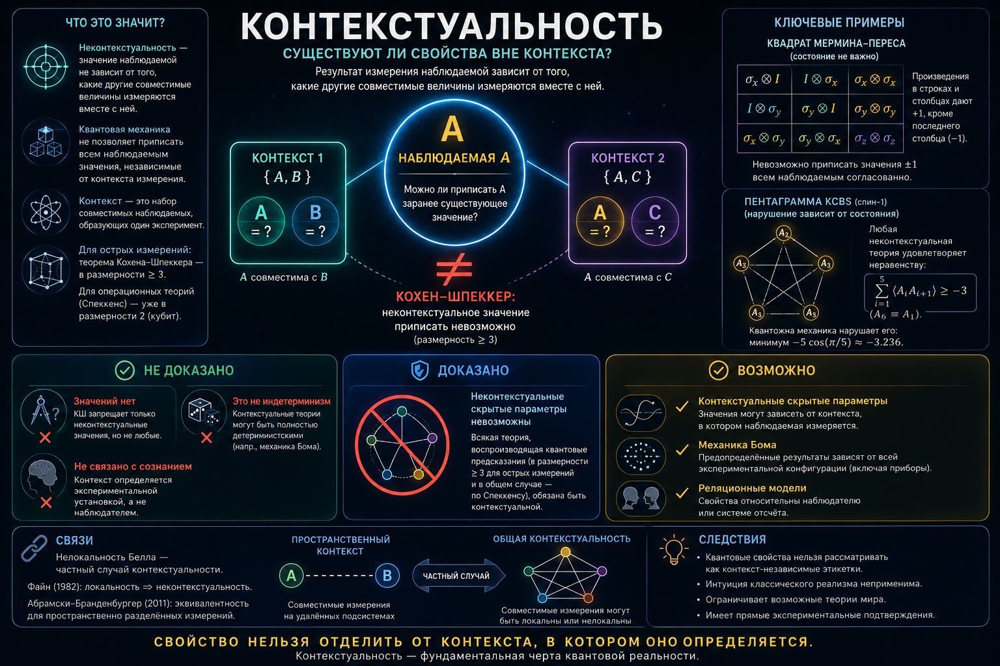

# Контекстуальность

Контекстуальность — это, пожалуй, самый интерпретационно-нейтральный из всех «запретов» квантовой механики и одновременно самый прямой удар по интуиции, согласно которой измерение лишь *считывает* заранее имеющееся у системы значение. Теорема Кохена–Шпеккера показывает, что эта интуиция несостоятельна: нельзя приписать наблюдаемым определённые значения так, чтобы они не зависели от того, какие *другие*, совместимые с ними величины измеряются заодно. Иными словами, результат измерения наблюдаемой — если считать его предварительно данным — оказывается зависящим от *контекста*: от того набора совместимых наблюдаемых, в котором она измеряется.

Эта статья завершает триаду раздела: [проблема измерения](../measurement/) спрашивает, почему вообще возникает один исход; [индетерминизм](../indeterminism/) — предопределён ли он; контекстуальность ставит ещё более глубокий метафизический вопрос — **можно ли вообще мыслить квантовую систему как обладающую определёнными свойствами, которые измерение лишь обнаруживает?** В отличие от [правила Борна](../born-rule/), здесь речь не о вероятностях исходов, а об онтологии самих свойств. И, как мы увидим, контекстуальность оказывается более общим явлением, частным случаем которого служит знаменитая нелокальность Белла.

## Формулировка

### Неконтекстуальность как скрытое допущение

Наивный реалист хотел бы считать, что у системы есть набор определённых значений всех её свойств, а измерение их просто вскрывает. Чтобы это допущение работало, нужно ещё одно, обычно невысказываемое: значение наблюдаемой \\(A\\) не должно зависеть от того, что измеряется *вместе* с ней. Поясним на примере. Пусть \\(A\\) совместима (коммутирует) и с \\(B\\), и с \\(C\\), но сами \\(B\\) и \\(C\\) несовместимы между собой. Тогда \\(A\\) можно измерить либо в контексте \\(\{A,B\}\\), либо в контексте \\(\{A,C\}\\). *Неконтекстуальность* — это предположение, что предсказанное значение \\(A\\) одно и то же в обоих случаях, то есть не зависит от выбора «компаньона».

Теорема Кохена–Шпеккера (1967) доказывает, что в гильбертовом пространстве размерности \\(\ge 3\\) такое неконтекстуальное приписывание значений невозможно: не существует способа разметить все проекторы значениями \\(0\\) и \\(1\\) так, чтобы в каждом полном наборе взаимно ортогональных проекторов ровно один получал единицу. Любая попытка приписать предварительно данные значения наталкивается на логическое противоречие. Это no-go-теорема того же класса, что и теорема Белла, но запрещает она другое: Белл исключает *локальные* скрытые параметры, Кохен и Шпеккер — *неконтекстуальные*.

### Два прочтения контекстуальности

Различим сразу две версии понятия — это убережёт от путаницы в дальнейшем.

**Контекстуальность Кохена–Шпеккера** — исходная, «жёсткая»: она формулируется для острых (проективных) измерений и для детерминированных приписываний значений. Контекст — это набор совместно измеримых наблюдаемых, а сама теорема живёт в размерности \\(\ge 3\\).

**Операционная контекстуальность Спеккенса** (2005) — обобщение, снимающее три ограничения сразу. Она определяется (1) для произвольных операциональных теорий, а не только квантовой; (2) для любых процедур — приготовления, преобразования, нерезкого измерения (POVM), а не только острых измерений; (3) для широкого класса онтологических моделей, а не только детерминированных. Принципиально, что эта версия даёт запрет уже в размерности 2 — на уровне кубита, где исходная КШ бессильна. Тем самым контекстуальность перестаёт быть «эффектом высоких размерностей» и оказывается куда более фундаментальной чертой.

Особую роль играет *подготовительная* контекстуальность Спеккенса: она напрямую связана со статусом волновой функции. Об этом — в разделе «Что доказано».

## История вопроса

Необходимость контекстуальности неформально обсуждала ещё Грете Герман в 1935 году, разбирая (и опровергая) доказательство фон Неймана о невозможности скрытых параметров. Но строгие доказательства появились лишь спустя три десятилетия и почти одновременно: Саймон Кохен и Эрнст Шпеккер (1967), с одной стороны, и Джон Белл (опубликовано в 1966) — с другой, независимо построили доказательства того, что всякая реалистическая скрытопараметрическая теория, воспроизводящая предсказания квантовой механики, обязана быть контекстуальной в размерности три и выше. Белл при этом опирался на ослабленную версию теоремы Глисона, переосмыслив её так, чтобы получить контекстуальность. Кохен и Шпеккер вдобавок построили явную неконтекстуальную модель для двумерного случая (кубита), завершив тем самым характеризацию: контекстуальность начинается с размерности три.

Исходное доказательство Кохена–Шпеккера использовало 117 направлений в трёхмерном пространстве — оно громоздко. Со временем появились куда более прозрачные конструкции. Две из них стали каноническими: **квадрат Мермина–Переса** и **пентаграмма KCBS** Клячко, Джана, Биниджиоглу и Шумовского (2008) — пять наблюдаемых спина-1, дающих state-dependent неравенство неконтекстуальности, которое квантовая теория нарушает. Эти примеры сделали контекстуальность не музейной диковиной, а рабочим, проверяемым в лаборатории явлением.

**Почему квадрат Мермина так популярен.** Если для нелокальности эталоном простоты служит неравенство CHSH, то для контекстуальности эту роль играет квадрат Мермина–Переса — и по схожей причине. Возьмём таблицу 3×3, заполненную произведениями двухкубитных операторов Паули, подобранными так, что все наблюдаемые внутри каждой строки и каждого столбца попарно коммутируют (то есть составляют законный контекст), и при этом произведение операторов в каждой строке и в первых двух столбцах равно \\(+\hat I\\), а в третьем столбце — \\(-\hat I\\). Теперь попробуем приписать каждой клетке предварительно данное значение \\(\pm 1\\), не зависящее от того, по строке или по столбцу мы её читаем (это и есть неконтекстуальность). Перемножив значения по всем трём строкам, получим \\(+1\\); перемножив по всем трём столбцам — \\(-1\\). Но это одно и то же произведение всех девяти клеток — противоречие. Сила аргумента в том, что он *не зависит от состояния* системы, не использует ни вероятностей, ни неравенств, ни геометрии направлений — чистый подсчёт чётности. Именно эта элементарность, как и у CHSH, сделала квадрат Мермина стандартным наглядным доказательством и удобной мишенью для эксперимента.

## Что доказано, а что нет

Теорема Кохена–Шпеккера запрещает приписать наблюдаемым неконтекстуальные предварительно данные значения. Она не доказывает ни того, что значений нет вовсе, ни индетерминизма, ни нелокальности, ни «зависимости от сознания наблюдателя».

> Теорема Кохена–Шпеккера запрещает приписать наблюдаемым *неконтекстуальные* предварительно данные значения. Она не доказывает ни того, что значений нет вовсе, ни индетерминизма, ни нелокальности, ни «зависимости от сознания наблюдателя».

Разберём по пунктам, чего теорема **не** утверждает.

**Не «значений нет».** КШ совместима с тем, что значения существуют — но контекстуальны, то есть зависят от полной экспериментальной установки. Явный пример такой теории — механика де Бройля–Бома: в ней у частиц есть определённые положения, а исход измерения зависит от всей конфигурации прибора. Бом — живое доказательство того, что КШ не убивает скрытые параметры, а лишь вынуждает их быть контекстуальными.

**Не индетерминизм.** Контекстуальная скрытопараметрическая теория может быть полностью детерминированной (тот же Бом). Контекстуальность и индетерминизм — независимые вещи (подробнее — в эссе об [индетерминизме](../indeterminism/)).

**Не нелокальность — но связь есть, и глубокая.** КШ относится к одной системе; никакого пространственного разнесения для неё не требуется. Однако Артур Файн (1982) показал, что в сценарии, где применимы неравенства CHSH, факторизуемая (локальная) скрытопараметрическая модель существует тогда и только тогда, когда существует неконтекстуальная. Самсон Абрамски и Адам Бранденбургер позже доказали эту эквивалентность в общем виде. Отсюда вывод, важный для всего раздела: **нелокальность есть частный случай контекстуальности** — тот, в котором совместно измеряемые наблюдаемые разнесены пространственно-подобно. 

**Не «зависимость от наблюдателя».** «Контекст» здесь — это набор совместно измеряемых физических величин, то есть конфигурация установки, а не сознание и не субъективный выбор. Контекстуальность не вводит наблюдателя-как-разум в физику.

### Удар по эпистемическим моделям волновой функции

Отдельная и сильная нить тянется от подготовительной контекстуальности Спеккенса. Он показал, что подготовительно-неконтекстуальные модели обязаны быть *максимально эпистемическими* (грубо: перекрытие квантовых состояний целиком объясняется незнанием о некоем реальном состоянии), а такие модели, в свою очередь, обязаны быть КШ-неконтекстуальными. Сложив это с теоремой Кохена–Шпеккера, получаем: максимально эпистемические модели исключены. Это прямой удар по прочтению, в котором \\(\psi\\) — лишь выражение нашего знания (ψ-эпистемическая позиция), и аргумент в пользу того, что волновая функция объективна. Подробный разбор этой линии — в будущей статье о статусе волновой функции; здесь достаточно отметить, что контекстуальность оказывается одним из её главных инструментов.

### Экспериментальный статус

Тут есть тонкость. Теорема Кохена–Шпеккера — это логическое противоречие, не зависящее от состояния; «проверять» его в лоб странно. Поэтому экспериментально работают двумя путями: либо со *state-independent* неравенствами (квадрат Мермина–Переса; неравенство Кабельо, 2008), либо со *state-dependent* (KCBS). Нарушение таких неравенств неконтекстуальности наблюдалось на захваченных ионах (Кирхмайр и др., 2009), фотонах, нейтронах, ядерных спинах — результаты согласуются с предсказаниями квантовой теории.

Честности ради надо назвать и две лазейки. Первая — **конечной точности**: Мейер, а затем Кент и Клифтон заметили, что при идеально точных направлениях КШ строга, но реальные измерения имеют конечную точность, и это в принципе могло бы «обнулить» теорему; ответ — построение устойчивых неравенств, нарушение которых конечной точностью не списать. Вторая — **совместимости и возмущения**: реальные последовательные измерения возмущают систему, так что «совместимость» соблюдается лишь приближённо; аккуратные неравенства и протоколы это контролируют, но полностью лазейку, как и в опытах Белла, закрыть труднее, чем кажется.

## Метафизические прочтения

Здесь — концептуальное сердце вопроса. Допустим, мы приняли теорему: неконтекстуальных предварительно данных значений нет. Что это говорит об *онтологии свойств*? Единого ответа нет; есть карта позиций, и они по-разному перестраивают само понятие «свойство».

**Реляционное прочтение.** Значения не интринсивны, а реляционны: свойство существует лишь *относительно* контекста (или, в реляционной квантовой механике Ровелли, относительно системы, с которой происходит взаимодействие). Тогда контекстуальность не парадокс, а прямое следствие: бессмысленно спрашивать о значении «самом по себе», вне отношения, в котором оно определяется.

**Антиреализм относительно неизмеренного.** В копенгагенской традиции (и, по-своему, в QBism) у наблюдаемой, которую не измеряют, попросту нет факта о значении; значение «возникает» в акте измерения. Контекстуальность в этом свете означает, что нет предварительно данного значения, которому полагалось бы быть контекст-независимым, — нечему и зависеть, нечего и считывать.

**Диспозиционально-модальное прочтение.** У системы есть не значения, а *расположенности* (диспозиции, потенции, объективные возможности в смысле, восходящем к гейзенберговской *potentia* и попперовским propensities); что именно актуализируется, зависит от контекста измерения. Контекстуальность снова естественна: контекст — часть условий, в которых возможность переходит в действительность.

**Индетерминистическое прочтение.** Можно пойти дальше и заключить, что предварительно данных значений нет вовсе — ни контекстуальных, ни иных, — а исход измерения не считывается и не предопределяется, а *создаётся* в самом акте, причём какой именно — фундаментально случайно. Контекстуальность тогда читается как знак того, что измерение порождает результат, а не обнаруживает его: «вскрывать» нечего, ибо до взаимодействия факта об исходе не существует. Это прочтение естественно смыкается с тезисом о фундаментальном индетерминизме (в части индетерминизма исходов). Такую возможность теорема Кохена–Шпеккера также не исключает: контекстуальная теория может быть и строго детерминированной (ниже — о механике Бома), так что индетерминистическое прочтение — это выбор, а не следствие.

**Контекстуальные скрытые параметры.** Можно, напротив, сохранить определённые значения — ценой признания их контекстуальными. Механика Бома — образец: значения есть, но исход зависит от всей экспериментальной конфигурации. КШ для этой позиции — не препятствие, а спецификация: «да, скрытые параметры возможны, но обязаны быть контекстуальными».

**Холизм.** Наконец, можно считать, что значение — свойство неделимого целого «система + прибор», а не системы как таковой (близко к боровской «целостности явления»). Тогда приписывать значение системе отдельно от установки — категориальная ошибка, и контекстуальность лишь обнажает её.

Эти прочтения частично пересекаются (реляционное и холистское, антиреалистское и диспозициональное — близкие соседи), но различимы по тому, *что* они делают с понятием свойства: объявляют его относительным, несуществующим до измерения, диспозициональным, контекстуально-определённым или холистским. Общее у них одно: наивный образ «вещи с этикетками значений, которые прибор считывает» придётся оставить.

## Формализация и приложения

Из качественного наблюдения контекстуальность выросла в строгое, теоретико-независимое структурное понятие. В пучково-теоретическом подходе Абрамски–Бранденбургера её суть формулируется предельно ёмко: контекстуальность возникает там, где эмпирические данные *локально согласованы, но глобально несовместимы* — каждый отдельный контекст внутренне непротиворечив, а склеить их в единое глобальное приписывание нельзя. Этот взгляд порождает естественную иерархию (вероятностная → логическая → сильная контекстуальность) и связывает контекстуальность с явлениями далеко за пределами физики. Развёрнутый аппарат — пучки, графы, гиперграфы и многоместные отношения, меры контекстуальности — относится к специальному разделу о математических структурах квантовых корреляций и здесь не раскрывается.

Отметим лишь современный операционный поворот: из «курьёза оснований» контекстуальность превратилась в *ресурс*. Говард с соавторами (2014) показали, что именно контекстуальность снабжает «магией» дистилляцию магических состояний — ведущую схему отказоустойчивых квантовых вычислений; Раусендорф и другие установили её роль в измерительной модели вычислений (MBQC). Это операциональная, а не метафизическая сторона вопроса, и для нашего раздела она важна лишь как указание, что речь идёт не об абстракции, а о физически действенном различии между классическим и квантовым.

## Где мы сейчас

Контекстуальность занимает особое место среди оснований квантовой механики. Это самый интерпретационно-нейтральный из «запретов»: в отличие от споров о коллапсе или о смысле вероятности, теорема Кохена–Шпеккера — чистый результат о формализме, не требующий ни нелокальности, ни предположений о причинности, ни обращения к наблюдателю. Её главный итог можно сформулировать как переформулировку самого тезиса о скрытых параметрах:

> «Скрытых параметров нет» — неточно. Точнее: значения, если они вообще есть, обязаны быть контекстуальными; от классического образа контекст-свободно обладаемых свойств приходится отказаться.

Метафизически это означает, что свойство квантовой системы — не этикетка, которую измерение считывает, а нечто, определяемое лишь вместе с контекстом измерения; как именно понимать это «вместе» — реляционно, диспозиционально, холистски или антиреалистски — и есть предмет несовпадающих прочтений.

И, наконец, связки. Назад — к триаде: [измерение](../measurement/) спрашивает, почему возникает исход; [индетерминизм](../indeterminism/) — предопределён ли он; контекстуальность — могли ли значения существовать до измерения вообще; а [правило Борна](../born-rule/) задаёт веса этих исходов. Вперёд — два выхода: через теорему Файна контекстуальность открывает статью о *нелокальности* (нелокальность как её пространственный частный случай), а через подготовительную контекстуальность Спеккенса — статью о *статусе волновой функции* (удар по эпистемическим прочтениям \\(\psi\\)). Контекстуальность — узел, в котором сходятся почти все нити раздела.

И если свести всё сказанное к одной строке:

> Контекстуальность не говорит, какими являются свойства квантовых систем. Она говорит, какими они быть не могут, — контекст-независимыми.

---

## Литература

Ссылки ведут на первоисточники — препринты arXiv (свободный доступ) либо DOI-страницы журналов; книги даны без ссылки.

**Основные теоремы**

- S. Kochen, E. P. Specker. The Problem of Hidden Variables in Quantum Mechanics // *J. Math. Mech.* **17**, 59 (1967).
- J. S. Bell. On the Problem of Hidden Variables in Quantum Mechanics // *Rev. Mod. Phys.* **38**, 447 (1966). [DOI](https://doi.org/10.1103/RevModPhys.38.447)
- A. M. Gleason. Measures on the Closed Subspaces of a Hilbert Space // *J. Math. Mech.* **6**, 885 (1957). [DOI](https://doi.org/10.1512/iumj.1957.6.56050)
- G. Hermann. Die naturphilosophischen Grundlagen der Quantenmechanik // *Abhandlungen der Fries'schen Schule* **6**, 75 (1935).

**Чистые доказательства и обобщения**

- N. D. Mermin. Simple Unified Form for the Major No-Hidden-Variables Theorems // *Phys. Rev. Lett.* **65**, 3373 (1990).
- A. Peres. Incompatible Results of Quantum Measurements // *Phys. Lett. A* **151**, 107 (1990).
- A. A. Klyachko, M. A. Can, S. Binicioğlu, A. S. Shumovsky. Simple Test for Hidden Variables in Spin-1 Systems // *Phys. Rev. Lett.* **101**, 020403 (2008). [arXiv:0706.0126](https://arxiv.org/abs/0706.0126)
- R. W. Spekkens. Contextuality for Preparations, Transformations, and Unsharp Measurements // *Phys. Rev. A* **71**, 052108 (2005). [arXiv:quant-ph/0406166](https://arxiv.org/abs/quant-ph/0406166)

**Связь с нелокальностью; формальные рамки**

- A. Fine. Hidden Variables, Joint Probability, and the Bell Inequalities // *Phys. Rev. Lett.* **48**, 291 (1982). [DOI](https://doi.org/10.1103/PhysRevLett.48.291)
- S. Abramsky, A. Brandenburger. The Sheaf-Theoretic Structure of Non-Locality and Contextuality // *New J. Phys.* **13**, 113036 (2011). [arXiv:1102.0264](https://arxiv.org/abs/1102.0264)
- A. Cabello, S. Severini, A. Winter. Graph-Theoretic Approach to Quantum Correlations // *Phys. Rev. Lett.* **112**, 040401 (2014). [arXiv:1401.7081](https://arxiv.org/abs/1401.7081)

**Эксперимент и приложения**

- A. Cabello. Experimentally Testable State-Independent Quantum Contextuality // *Phys. Rev. Lett.* **101**, 210401 (2008). [DOI](https://doi.org/10.1103/PhysRevLett.101.210401)
- G. Kirchmair et al. State-Independent Experimental Test of Quantum Contextuality // *Nature* **460**, 494 (2009). [DOI](https://doi.org/10.1038/nature08172)
- M. Howard, J. Wallman, V. Veitch, J. Emerson. Contextuality Supplies the «Magic» for Quantum Computation // *Nature* **510**, 351 (2014). [DOI](https://doi.org/10.1038/nature13460)
- R. Raussendorf. Contextuality in Measurement-Based Quantum Computation // *Phys. Rev. A* **88**, 022322 (2013). [DOI](https://doi.org/10.1103/PhysRevA.88.022322)

**Обзоры**

- C. Budroni, A. Cabello, O. Gühne, M. Kleinmann, J.-Å. Larsson. Kochen–Specker Contextuality // *Rev. Mod. Phys.* **94**, 045007 (2022). [arXiv:2102.13036](https://arxiv.org/abs/2102.13036)
- J. Sheng, D. Zhang, L. Chen. Connecting Quantum Contextuality and Nonlocality (2026). [arXiv:2602.23221](https://arxiv.org/abs/2602.23221)

*Примечание по терминологии:*
- **contextuality** — контекстуальность;
- **noncontextual hidden variables** — неконтекстуальные скрытые параметры;
- **preparation contextuality** — подготовительная контекстуальность;
- **state-independent / state-dependent** — не зависящее / зависящее от состояния (доказательство, неравенство);
- **maximally epistemic model** — максимально эпистемическая модель.

*Теоремы Кохена–Шпеккера и Белла — разные no-go: первая о неконтекстуальности, вторая о локальности; по теореме Файна нелокальность есть частный случай контекстуальности.*

