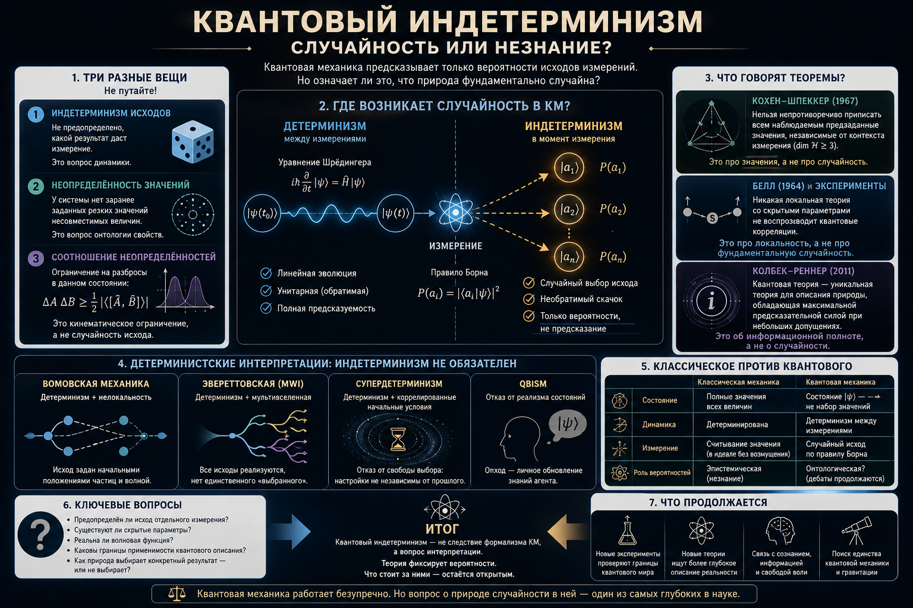

# Квантовый индетерминизм

Квантовая механика, кажется, впервые в истории физики вводит в фундаментальное описание природы необратимую случайность: одно и то же, приготовленное с максимально возможной полнотой состояние при измерении даёт разные исходы, и теория предсказывает лишь их вероятности. Это резко рвёт с классическим, лапласовским идеалом, где будущее однозначно определено прошлым. Главный вопрос этой статьи прост на словах и труден по существу: **действительно ли эта случайность фундаментальна — или она лишь видимость, за которой скрыт некий детерминизм?**

Сразу обозначу тезис, к которому мы придём. Утверждение «квантовая механика индетерминистична» — это не теорема, а интерпретационный выбор: существуют последовательные детерминистские прочтения, воспроизводящие все предсказания теории. А вот близкое, но другое утверждение — что у системы, вообще говоря, *нет заранее заданных резких значений* всех её свойств — почти теорема (Кохен–Шпеккер) и от интерпретации не зависит. Эти две вещи постоянно смешивают, и половина путаницы вокруг «квантовой неопределённости» происходит именно отсюда. Проблема тесно связана с [проблемой квантового измерения](../measurement/), но не тождественна ей: там нерв — согласованность двух динамик и единственность исхода; здесь — модальный статус исхода, то есть предопределён он или нет.

## Формулировка

### Что значит «индетерминизм»

Теория детерминистична, если состояние системы вместе с законами динамики однозначно фиксирует все факты о будущем. Классическая механика в этом смысле детерминистична (по крайней мере в идеале): задав положения и импульсы, мы в принципе вычисляем всю траекторию. Случайность подбрасываемой монеты — не нарушение детерминизма, а следствие нашего незнания начальных условий; это случайность *эпистемическая*.

Тонкость квантовой механики в том, что её основная динамика тоже детерминирована. Между измерениями вектор состояния $|\psi\rangle$ эволюционирует строго причинно по уравнению Шрёдингера:

$$i\hbar\,\frac{\partial}{\partial t}|\psi\rangle = \hat H\,|\psi\rangle.$$

Здесь нет ни тени случайности: задав $|\psi\rangle$ сейчас, мы знаем его в любой момент. Индетерминизм входит ровно в одной точке — в акте измерения, через правило Борна: наблюдаемой $\hat A$ с собственными состояниями $|a_i\rangle$ отвечает исход $a_i$ с вероятностью $|\langle a_i|\psi\rangle|^2$, и какой именно исход выпадет в отдельном опыте, теория не говорит. Таким образом, весь спор о квантовом индетерминизме локализован в *исходе измерения* — и потому неотделим от вопроса о том, что вообще есть измерение.

### Три разные вещи, которые нельзя путать

Под общим ярлыком «квантовая неопределённость» уживаются три логически независимых понятия. Их различение — несущая конструкция всего дальнейшего разбора.

**(1) Индетерминизм исходов** — динамический, или модальный, тезис: не предопределено, какой результат даст измерение. Это и есть наш главный предмет.

**(2) Неопределённость значений** — у системы, вообще говоря, нет совместных резких значений для несовместимых наблюдаемых *ещё до всякого измерения*. Это утверждение об онтологии свойств, а не о динамике.

**(3) Соотношение неопределённостей** (Робертсон–Шрёдингер) — для любого состояния произведение разбросов двух несовместимых величин ограничено снизу: $\Delta A\,\Delta B \ge \tfrac12|\langle[\hat A,\hat B]\rangle|$. Это кинематическое ограничение на *разбросы в данном состоянии*, и оно вообще не про случайность отдельного исхода. Его особенно часто путают и с (1), и с (2), а заодно с «эффектом наблюдателя» — возмущением системы прибором. Возмущение реально, но это отдельное явление: соотношение неопределённостей выполняется и тогда, когда никакого возмущающего измерения не производится.

Что эти понятия независимы, лучше всего видно на одном примере, к которому мы ещё вернёмся: **бомовская механика даёт максимальную неопределённость значений (никаких преднаданных неконтекстуальных значений — ровно по Кохену–Шпеккеру) при полном отсутствии индетерминизма исходов** — её динамика детерминистична, результат задан начальными положениями частиц. Значит, можно иметь (2) без (1). И наоборот: само по себе отсутствие резких значений ещё не влечёт, что выбор исхода случаен.

### Неопределённость значений как опора (Кохен–Шпеккер)

Поскольку неопределённость значений будет постоянно маячить рядом с индетерминизмом, очертим её отдельно — она заслуживает и собственного разбора.

Наивный реалист хотел бы приписать каждой наблюдаемой системы определённое значение, которое измерение лишь считывает, причём значение это не зависит от того, какие *другие*, совместимые величины измеряются заодно. Теорема Кохена–Шпеккера (1967) показывает, что в гильбертовом пространстве размерности $\ge 3$ это невозможно: нельзя непротиворечиво приписать всем проекторам значения $0$ или $1$ так, чтобы в каждом полном наборе взаимно ортогональных проекторов ровно один получал единицу. Иными словами, преднаданные значения могут существовать только *контекстуально* — завися от того, в каком наборе совместимых измерений рассматривается величина.

Это сильный, интерпретационно инвариантный результат: он следует из одного лишь формализма и не требует ни нелокальности, ни предположений о причинности (этим он отличается от теоремы Белла, к которой мы перейдём). Подчеркну важное: неопределённость значений — это про *отсутствие резких значений*, а не про *случайность их получения*. Она не утверждает, что природа «бросает кости»; она утверждает, что бросать, собственно, нечего — нет того преднаданного набора значений, который игра в кости разыгрывала бы.

### Индетерминизм или непредсказуемость?

Отсюда — центральная развилка. Квантовая случайность похожа на классическую монету или принципиально иная? В классике случайность *эпистемическая*: исход предопределён, мы просто не знаем достаточно. Если квантовая случайность такова же, то за вероятностями Борна скрыты «скрытые параметры», и индетерминизм — иллюзия неполного знания (позиция Эйнштейна). Если же она *онтическая* — никакого факта о будущем исходе попросту не существует до измерения, — то индетерминизм фундаментален.

Заметим, что это вопрос не о нашей способности предсказывать (непредсказуемость), а о том, есть ли что предсказывать (детерминированность). Детерминированная система может быть практически непредсказуемой (классический хаос), а индетерминированная — статистически вполне управляемой. Спор о квантовом индетерминизме — именно об онтологии, и решить его «в лоб» опытом нельзя: эксперимент видит частоты, а не модальный статус единичного исхода. Как мы увидим, всё, что дают эксперименты, — это закрытие определённых *классов* детерминистских объяснений, а не доказательство случайности как таковой.

## История вопроса

### Борн, Эйнштейн и рождение спора

Индетерминизм вошёл в физику с вероятностной интерпретацией волновой функции, которую Макс Борн предложил в 1926 году, разбирая процессы рассеяния. Уже в этой работе Борн прямо ставит вопрос о детерминизме: с точки зрения его теории нет величины, которая причинно определяла бы исход отдельного столкновения, и он оставляет открытым, скрыты ли такие определяющие свойства или их нет вовсе. Борн склонялся к тому, что их нет, — то есть к фундаментальной случайности.

Эйнштейн занял противоположную позицию, выраженную в знаменитой фразе из письма Борну 1926 года о том, что Бог не играет в кости. Для Эйнштейна вероятностный характер теории был признаком её *неполноты*, а не свойством мира. Этот спор — Борн против Эйнштейна, случайность фундаментальная против эпистемической — и есть исток всей темы; он не разрешён до сих пор, лишь многократно уточнён.

В 1927 году Гейзенберг сформулировал соотношение неопределённостей. Важно сразу оговорить: оно ограничивает совместную определённость несовместимых величин, но само по себе *не* доказывает индетерминизма исходов — это разные утверждения (см. выше), и историческое отождествление их было источником долгой путаницы.

### ЭПР и попытка вернуть детерминизм

В 1935 году Эйнштейн, Подольский и Розен предъявили аргумент: если квантовая механика верна и при этом локальна, то описание состояния неполно. Рассматривая запутанную пару, они показали, что результат измерения над одной частицей позволяет с достоверностью предсказать результат над далёкой второй — а значит, по их критерию реальности, у второй частицы соответствующая величина имеет преднаданное значение, которого формализм не содержит. Вывод ЭПР: нужны скрытые параметры, восстанавливающие и детерминизм, и локальность. Это была программа спасения классической картины.

### Теорема фон Неймана и её поучительный провал

Казалось, программу скрытых параметров закрыл ещё фон Нейман: в 1932 году он привёл «доказательство» их невозможности. На несколько десятилетий это «доказательство» отбило у физиков охоту искать детерминистские расширения теории. Между тем оно опиралось на неоправданно сильное допущение (аддитивность средних значений переносится и на дисперсные, «скрытые» состояния), которое для несовместимых наблюдаемых попросту неверно.

На дефект указала Грете Герман ещё в 1935 году — и её работа была почти полностью проигнорирована. Лишь Джон Белл в 1966 году заново и публично разобрал ошибку, показав, что формальная теорема фон Неймана не обосновывает его неформального вывода. История поучительна: ложно понятая теорема о невозможности на десятилетия сузила пространство допустимых идей. Это прямое предостережение против поспешного провозглашения вопроса закрытым — мотив, к которому я ещё вернусь в финале.

### Глисон, Белл, Кохен–Шпеккер

Дальше последовала серия точных результатов, очертивших, что именно невозможно. Теорема Глисона (1957) установила, что в размерности $\ge 3$ единственный непротиворечивый способ приписать вероятности — это правило Борна с матрицей плотности, что уже сильно стесняет «дописывание» теории. Теорема Белла (1964) показала, что *локальные* скрытопараметрические теории дают для запутанных систем корреляции, удовлетворяющие неравенствам, которые квантовая механика нарушает: вернуть детерминизм скрытыми параметрами можно только ценой нелокальности. Теорема Кохена–Шпеккера (1967) добавила, что преднаданные значения, если они есть, обязаны быть контекстуальными.

Все три — теоремы *о невозможности определённых классов* скрытых параметров, а не доказательства фундаментального индетерминизма. Это различие критически важно и постоянно теряется в популярных изложениях.

### От Аспе до безлазеечных тестов

Неравенства Белла из философского предмета стали экспериментальными. Опыты Аспе с сотрудниками (1982) с быстро переключаемыми анализаторами впервые сделали тест убедительным, хотя и не безупречным: оставались «лазейки» (локальности, детектирования, свободы выбора), через которые локальный реалист мог формально спастись. Их закрыли лишь в 2015 году сразу три группы — Хенсена в Делфте (на электронных спинах в алмазе, разнесённых на 1,3 км), Джустины и Шалма (на запутанных фотонах). Эти безлазеечные тесты — нынешний золотой стандарт.

Но вот что необходимо подчеркнуть, и это главный тезис следующего раздела: безлазеечные тесты Белла **не доказывают**, что природа индетерминирована. Они опровергают *локальный реализм* — конъюнкцию локальности и преднаданных значений. Детерминизм как таковой они не закрывают.

### Современный слой: насколько случайность фундаментальна

В последние двадцать лет вопрос заострили теоретико-информационными средствами. Теорема о свободе воли Конвея–Кохена (2006) в провокационной формулировке утверждает: если у экспериментаторов есть свобода выбора настроек, то и отклик частиц не может быть функцией прошлого — «свобода» наверху влечёт «свободу» внизу. Колбек и Реннер (2011) доказали более общее: при допущении свободного выбора измерений никакое расширение квантовой теории не даёт более точных предсказаний об исходах, чем она сама, — то есть остаточная случайность неустранима *внутри* класса теорий с этим допущением. На этом же основана сертифицированная (приборно-независимая) генерация случайных чисел: нарушение неравенств Белла используют как гарантию того, что биты действительно случайны, а не подсунуты изготовителем устройства. (Отмечу для полноты и более нишевую линию — работу Патерека с соавторами 2010 года, связывающую квантовую случайность с логической независимостью посылок; это любопытный, но частный результат, не опора темы.)

Узловой момент во всех этих результатах один: они держатся на предположении о *свободе выбора* (независимости настроек измерения от скрытого состояния) — на том самом, которое отрицает супердетерминизм. К этому мы сейчас и придём.

## Фундаментален ли индетерминизм?

### Что доказано, а что нет

Подведём строгий баланс. Экспериментально и теоретически установлено: (а) локальные скрытопараметрические теории исключены (Белл + опыты); (б) неконтекстуальные преднаданные значения исключены (Кохен–Шпеккер); (в) при свободе выбора квантовая теория максимально информативна (Колбек–Реннер). Чего *не* установлено: что исход измерения фундаментально случаен. Детерминизм выживает — но за каждый способ его сохранить приходится платить отказом от чего-то ещё. Разложим возможности по тому, какую цену они платят; это, как и в случае [проблемы измерения](../measurement/), превращает список «интерпретаций» в карту логического пространства.

### Детерминистские прочтения: индетерминизм мнимый

**Волна-пилот де Бройля–Бома.** Самый чистый способ сохранить детерминизм. Помимо волновой функции постулируются частицы с определёнными положениями; те движутся строго детерминированно под управлением волны. Случайность исхода целиком эпистемическая — она от незнания начальных положений, распределённых по «квантовому равновесию» $|\psi|^2$, ровно как случайность монеты. Цена: теорема Белла гарантирует, что такая теория обязана быть нелокальной, а согласовать её с релятивистской ковариантностью без выделенной одновременности до сих пор не удаётся. Никаких новых предсказаний сверх стандартной теории нет.

**Эвереттовская (многомировая) интерпретация.** Здесь динамика тоже строго унитарна и детерминирована: универсальная волновая функция эволюционирует без всякого коллапса. «Случайность» переосмысляется как *самолокализующая неопределённость* — все исходы реализуются в ветвящихся мирах, и вопрос лишь в том, в какой ветви обнаружит себя данный наблюдатель. Формально мир детерминирован; индетерминизм — иллюзия точки зрения изнутри ветви. Цена: онтологическая расточительность и нерешённая до конца проблема вероятностей (почему именно $|\psi|^2$, если случается всё). См. подробнее разбор в статье о проблеме измерения.

**Супердетерминизм.** Радикальный ход ('т Хоофт и немногие другие): сохранить и локальность, и детерминизм, отказавшись от свободы выбора — предположить, что настройки измерения скоррелированы с прошлым состоянием частиц. Тогда нарушение неравенств Белла объясняется без нелокальности. Цена, на мой взгляд, неприемлемо высока: требуется тонкая «вселенская подстройка» начальных условий, воспроизводящая квантовые корреляции при любых мыслимых способах выбора настроек, вплоть до использования света далёких квазаров. Это не опровергнуто экспериментально — но подрывает само понятие контролируемого эксперимента и потому почти всеми отвергается как заговорщическое. Честно, однако, признать: формально это работающая лазейка.

**Ретропричинные и времясимметричные схемы.** Сохраняют локальность и определённость, допуская влияние будущего выбора на прошлое поведение системы. Экзотично, активно разрабатывается, общепринятым решением не является.

### Подлинно индетерминистские прочтения

**Копенгагенско-стандартная линия.** Случайность Борна принимается как неустранимая и первичная; вопрос «что на самом деле происходит между измерениями» либо объявляется лишённым смысла, либо выносится за скобки. Индетерминизм здесь — не выводимое следствие, а постулат.

**Объективный коллапс (GRW, CSL, Пенроуз).** Единственный класс, где индетерминизм становится *физическим законом*: к уравнению Шрёдингера добавляются стохастические нелинейные члены, спонтанно локализующие состояние. Случайность тут фундаментальна и встроена в динамику. Огромное достоинство — фальсифицируемость: эти теории предсказывают отличия от стандартной механики, которые ищут в опыте. Подробнее — в статье о проблеме измерения.

### Сильнейший довод за фундаментальность — и его предел

Самый сильный позитивный аргумент в пользу того, что случайность фундаментальна, даёт теорема Колбека–Реннера в связке с приборно-независимой случайностью: если принять, что измерения выбираются свободно, то квантовая теория уже максимально предсказательна, и остаточная случайность принципиально неустранима — её нельзя «дообъяснить» никаким расширением. А сертифицированные генераторы случайных чисел операционализируют это: они производят случайность, гарантированную теоремой Белла, а не доверием к устройству.

Но именно здесь — предел аргумента, и его надо назвать прямо. Все эти результаты опираются на допущение свободы выбора (независимости измерения). А это ровно то допущение, которое отрицает супердетерминизм. Тем самым доказательства фундаментальной случайности не замыкают круг — они *перемещают* нагрузку на предпосылку о свободе выбора. Кто готов пожертвовать ею (ценой космического заговора), тот сохраняет детерминизм при любых экспериментах. Логически вопрос остаётся открытым; закрывает его не теорема, а оценка приемлемости цены.

### Честный итог раздела

«Квантовая механика индетерминистична» — это интерпретационный выбор, а не теорема. Что действительно близко к теореме — это неопределённость значений (Кохен–Шпеккер): преднаданных неконтекстуальных значений нет, и здесь все интерпретации согласны. Индетерминизм же исходов реален в одних прочтениях (Копенгаген, объективный коллапс) и мним в других (Бом, Эверетт, супердетерминизм). Опыт сузил поле — выбросил локальный реализм и неконтекстуальные значения, — но финального вердикта о случайности не вынес и вынести не может.

## Где мы сейчас

Если расположить всё на одной оси, картина такая. Эксперимент закрыл локальный реализм окончательно (безлазеечные тесты 2015 года). Остались, грубо, четыре непротиворечивые позиции, и каждая платит свою цену: фундаментальный индетерминизм (Копенгаген, объективный коллапс) — ценой первичной, ничем не объяснённой случайности; детерминизм с нелокальностью (Бом) — ценой выделенной одновременности и трудностей с релятивизмом; детерминизм без единственности исхода (Эверетт) — ценой множества миров; детерминизм с отказом от свободы выбора (супердетерминизм) — ценой вселенского заговора. Та предпосылка, что делает всю реальную работу в «доказательствах случайности», — это свобода выбора измерения; именно она, а не формализм, отделяет последние две позиции от первых двух.

Моя позиция как автора — и я обозначаю её именно как позицию, а не как установленный факт. Фундаментальный индетерминизм представляется наиболее естественным прочтением, поскольку требует наименьшего числа экзотических обязательств: ни нелокальных «бомовских» сущностей, ни умножения миров, ни космической подстройки начальных условий. Но это метафизическая ставка, а не вывод из опыта. Симметрично стоит сказать и обратное: настойчивое желание во что бы то ни стало вернуть детерминизм — тоже метафизическое предпочтение, унаследованное от Лапласа и Эйнштейна, а не требование данных. Здравая дисциплина мысли — держать фундаментальную случайность как рабочую гипотезу, не выдавая её за доказанную и не считая её дефектом, подлежащим устранению любой ценой.

И последнее, что связывает эту тему с [проблемой квантового измерения](../measurement/): дилемма индетерминизма — это в точности один из «рогов» проблемы измерения (почему в детерминированную унитарную теорию входит случайный исход). Кто понял, что ни один эксперимент не обязывает нас ни к случайности, ни к скрытому детерминизму, тот защищён сразу от двух крайностей — от ходячего «квантовая физика доказала, что мир случаен» и от противоположного «где-то непременно спрятан детерминизм».

---

## Литература

Ссылки ведут на первоисточники — препринты arXiv (свободный доступ) либо DOI-страницы журналов; книги даны без ссылки.

**Истоки спора**

- M. Born. Zur Quantenmechanik der Stoßvorgänge // *Z. Phys.* **37**, 863 (1926). [DOI](https://doi.org/10.1007/BF01397477)
- W. Heisenberg. Über den anschaulichen Inhalt der quantentheoretischen Kinematik und Mechanik // *Z. Phys.* **43**, 172 (1927). [DOI](https://doi.org/10.1007/BF01397280)
- A. Einstein, B. Podolsky, N. Rosen. Can Quantum-Mechanical Description of Physical Reality Be Considered Complete? // *Phys. Rev.* **47**, 777 (1935). [DOI](https://doi.org/10.1103/PhysRev.47.777)
- M. Born (Hrsg.). *Albert Einstein — Max Born. Briefwechsel 1916–1955*. Nymphenburger, 1969 (письмо 1926 г. — «Бог не играет в кости»).

**Теоремы о невозможности**

- J. von Neumann. *Mathematische Grundlagen der Quantenmechanik*. Springer, 1932 (англ. пер.: Princeton University Press, 1955).
- G. Hermann. Die naturphilosophischen Grundlagen der Quantenmechanik // *Abhandlungen der Fries'schen Schule* **6**, 75 (1935).
- A. M. Gleason. Measures on the Closed Subspaces of a Hilbert Space // *J. Math. Mech.* **6**, 885 (1957). [DOI](https://doi.org/10.1512/iumj.1957.6.56050)
- J. S. Bell. On the Einstein Podolsky Rosen Paradox // *Physics Physique Fizika* **1**, 195 (1964). [DOI](https://doi.org/10.1103/PhysicsPhysiqueFizika.1.195)
- J. S. Bell. On the Problem of Hidden Variables in Quantum Mechanics // *Rev. Mod. Phys.* **38**, 447 (1966). [DOI](https://doi.org/10.1103/RevModPhys.38.447)
- S. Kochen, E. P. Specker. The Problem of Hidden Variables in Quantum Mechanics // *J. Math. Mech.* **17**, 59 (1967).

**Эксперименты**

- A. Aspect, J. Dalibard, G. Roger. Experimental Test of Bell's Inequalities Using Time-Varying Analyzers // *Phys. Rev. Lett.* **49**, 1804 (1982). [DOI](https://doi.org/10.1103/PhysRevLett.49.1804)
- B. Hensen et al. Loophole-Free Bell Inequality Violation Using Electron Spins Separated by 1.3 Kilometres // *Nature* **526**, 682 (2015). [arXiv:1508.05949](https://arxiv.org/abs/1508.05949)
- M. Giustina et al. Significant-Loophole-Free Test of Bell's Theorem with Entangled Photons // *Phys. Rev. Lett.* **115**, 250401 (2015). [arXiv:1511.03190](https://arxiv.org/abs/1511.03190)
- L. K. Shalm et al. Strong Loophole-Free Test of Local Realism // *Phys. Rev. Lett.* **115**, 250402 (2015). [arXiv:1511.03189](https://arxiv.org/abs/1511.03189)

**Истолкования и фундаментальность случайности**

- D. Bohm. A Suggested Interpretation of the Quantum Theory in Terms of «Hidden» Variables. I // *Phys. Rev.* **85**, 166 (1952). [DOI](https://doi.org/10.1103/PhysRev.85.166)
- H. Everett. «Relative State» Formulation of Quantum Mechanics // *Rev. Mod. Phys.* **29**, 454 (1957). [DOI](https://doi.org/10.1103/RevModPhys.29.454)
- J. Conway, S. Kochen. The Free Will Theorem // *Found. Phys.* **36**, 1441 (2006).
- R. Colbeck, R. Renner. No Extension of Quantum Theory Can Have Improved Predictive Power // *Nat. Commun.* **2**, 411 (2011). [arXiv:1005.5173](https://arxiv.org/abs/1005.5173)
- S. Pironio et al. Random Numbers Certified by Bell's Theorem // *Nature* **464**, 1021 (2010).
- G. 't Hooft. *The Cellular Automaton Interpretation of Quantum Mechanics*. Springer, 2016.
- T. Paterek et al. Logical Independence and Quantum Randomness // *New J. Phys.* **12**, 013019 (2010). [arXiv:0811.4542](https://arxiv.org/abs/0811.4542)

*Примечание по терминологии: value-indeterminacy — неопределённость значений; measurement independence / free choice — независимость измерения / свобода выбора; self-locating uncertainty — самолокализующая неопределённость; quantum equilibrium — квантовое равновесие; loophole-free Bell test — безлазеечный тест Белла; device-independent randomness — приборно-независимая (сертифицированная) случайность. Соотношение неопределённостей (Гейзенберга) и индетерминизм исходов — разные вещи; в тексте они сознательно разведены.*

